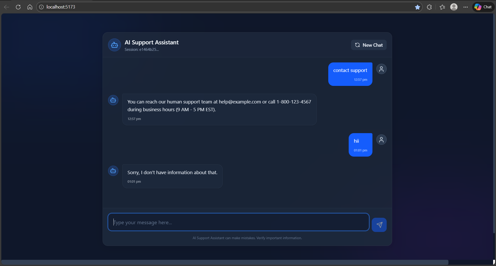

# AI-Powered Support Assistant

A full-stack AI-powered Support Assistant built with React, Node.js (Express), and SQLite. This assistant uses Google's Gemini LLM to answer user queries strictly based on a provided knowledge base (`docs.json`).

## 🧠 Tech Stack

- **Frontend:** React.js (Vite), Tailwind CSS v4, Lucide React
- **Backend:** Node.js, Express.js
- **Database:** SQLite
- **LLM:** Google Gemini (`gemini-2.5-flash`)

---

## 🚀 Features

- **Document-Based Answers:** Assistant only answers based on the provided `docs.json`. Out-of-scope questions get a standard "Sorry, I don't have information about that." response.
- **Session Identity:** Generates a unique `sessionId` (UUID) stored in LocalStorage to maintain a user's session across reloads.
- **Conversation Context:** Remembers the last 5 conversation pairs to provide context-aware answers.
- **Persistent Storage:** All sessions and messages are securely stored in a local SQLite database.
- **Rate Limiting:** IP-based rate limiting (20 requests/min via `express-rate-limit`) to prevent abuse.
- **Beautiful UI:** Sleek glassmorphism effect using Tailwind CSS and abstract animated backgrounds.

---

## 🛠️ Setup Instructions

### 1. Prerequisites
- Node.js (v18+ recommended)
- A Google Gemini API Key

### 2. Backend Setup
1. Navigate to the backend folder:
   ```bash
   cd backend
   ```
2. Install dependencies:
   ```bash
   npm install
   ```
3. Set up the environment variables:
   Copy `.env.example` to `.env` and configure your API key.
   ```bash
   cp .env.example .env
   ```
   **Update the `.env` file:**
   ```env
   PORT=5000
   GEMINI_API_KEY=your_gemini_api_key_here
   FRONTEND_URL=http://localhost:5173
   ```
4. Initialize the database:
   ```bash
   npm run init-db
   ```
5. Start the server:
   ```bash
   npm start
   ```
   The backend will run on `http://localhost:5000`.

### 3. Frontend Setup
1. Navigate to the frontend folder:
   ```bash
   cd frontend
   ```
2. Install dependencies:
   ```bash
   npm install
   ```
3. Start the Vite development server:
   ```bash
   npm run dev
   ```
   The frontend will run on `http://localhost:5173`. Open this in your browser to start chatting!

---

## 📚 API Documentation

### `POST /api/chat`
Handles incoming chat messages and returns the AI's response.
**Request Body:**
```json
{
  "sessionId": "123e4567-e89b-12d3-a456-426614174000",
  "message": "How can I reset my password?"
}
```
**Response:**
```json
{
  "reply": "Users can reset password from Settings > Security and clicking on 'Reset Password'. A link will be sent to the registered email.",
  "tokensUsed": 134
}
```

---

### `GET /api/conversations/:sessionId`
Returns the full conversation history for a given session.
**Response:**
```json
[
  {
    "id": 1,
    "role": "user",
    "content": "Hi",
    "created_at": "2026-02-23T15:00:00.000Z"
  }
]
```

---

### `GET /api/sessions`
Returns a list of all active session IDs.
**Response:**
```json
[
  {
    "id": "123e4567-e89b-12d3-a456-426614174000",
    "updated_at": "2026-02-23T15:00:00.000Z"
  }
]
```

---

## 🗄️ Database Schema (SQLite)

### Table: `sessions`
| Column | Type | Notes |
|:---|:---|:---|
| `id` | TEXT | Primary Key (UUID) |
| `created_at` | DATETIME | Defaults to Current Timestamp |
| `updated_at` | DATETIME | Updated on new messages |

### Table: `messages`
| Column | Type | Notes |
|:---|:---|:---|
| `id` | INTEGER | Primary Key (Auto Increment) |
| `session_id` | TEXT | Foreign Key -> `sessions(id)` |
| `role` | TEXT | Enforced `CHECK(role IN ('user', 'assistant'))` |
| `content` | TEXT | The message body |
| `created_at` | DATETIME | Defaults to Current Timestamp |

---

## 💭 Assumptions & Design Decisions
1. **Model Selection:** `gemini-2.5-flash` was chosen for its low latency and high accuracy with strict prompting.
2. **Context Window:** SQLite query specifically limits the conversation fetch to `LIMIT 10` (the last 5 pairs) to prevent prompt explosion and keep latency minimal while satisfying requirements.
3. **Database Architecture:** Used native `sqlite3` driver over ORMs like Sequelize or Prisma to keep the codebase lightweight and straightforward for this assignment.
4. **Session Identifier:** Random UUIDs are generated on the frontend using `uuid` library and are locally stored rather than traditional JWT auth since there are no user accounts.

# UI - Screenshots


